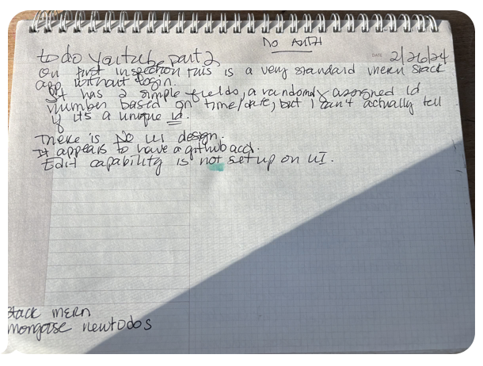

# To Do App 

I have looked through this app and made notes as to its present condition and its potential. They are pictured below. 

## Add Sortable

Sortable is an npm package for react apps that make items in an array sortable using a drag and drop library. The sortable items have to be wrapped in a sortable context which is in a react-bootstrap container. 

**Dependancies**

```
npm install bootstrap react-bootstrap @dnd-kit/core @dnd-kit/utilities @dnd-kit/sortable
```

**App.js in imports**

```js
import './App.css';
import 'bootstrap/dist/css/bootstrap.min.css';
import Container from 'react-bootstrap/Container';
import {
  DndContext,
  closestCenter
} from "@dnd-kit/core";
import {
  arrayMove,
  SortableContext,
  verticalListSortingStrategy
} from "@dnd-kit/sortable";
import {useState} from 'react';
import { SortableItem } from './SortableItem';
```

**App.js Array**

```js
const [languages, setLanguages ] = useState(["JavaScript", "Python", "TypeScript"]);
```

**App.js in return ()**

```<jsx>
<DndContext
      collisionDetection={closestCenter}
      onDragEnd={handleDragEnd}
    >
      <Container className="p-3" style={{"width": "50%"}} align="center">
        <h3>The best programming languages!</h3>
        <SortableContext
          items={languages}
          strategy={verticalListSortingStrategy}
        >
          {languages.map(language => <SortableItem key={language} id={language}/>)}
        </SortableContext>
      </Container>
    </DndContext>


```
**App.js functionality**

```js
 function handleDragEnd(event) {
    console.log("Drag end called");
    const {active, over} = event;
    console.log("ACTIVE: " + active.id);
    console.log("OVER :" + over.id);

    if(active.id !== over.id) {
      setLanguages((items) => {
        const activeIndex = items.indexOf(active.id);
        const overIndex = items.indexOf(over.id);
        console.log(arrayMove(items, activeIndex, overIndex));
        return arrayMove(items, activeIndex, overIndex);
      });
      }
```

**App.css**

```css
.App {
  text-align: center;
}

.App-logo {
  height: 40vmin;
  pointer-events: none;
}

@media (prefers-reduced-motion: no-preference) {
  .App-logo {
    animation: App-logo-spin infinite 20s linear;
  }
}

.App-header {
  background-color: #282c34;
  min-height: 100vh;
  display: flex;
  flex-direction: column;
  align-items: center;
  justify-content: center;
  font-size: calc(10px + 2vmin);
  color: white;
}

.App-link {
  color: #61dafb;
}

@keyframes App-logo-spin {
  from {
    transform: rotate(0deg);
  }
  to {
    transform: rotate(360deg);
  }
}
```

**App.js**

```js
import logo from './logo.svg';
import './App.css';
import 'bootstrap/dist/css/bootstrap.min.css';
import Container from 'react-bootstrap/Container';
import {
  DndContext,
  closestCenter
} from "@dnd-kit/core";
import {
  arrayMove,
  SortableContext,
  verticalListSortingStrategy
} from "@dnd-kit/sortable";
import {useState} from 'react';
import { SortableItem } from './SortableItem';

function App() {
  const [languages, setLanguages ] = useState(["JavaScript", "Python", "TypeScript"]);

  return (
    <DndContext
      collisionDetection={closestCenter}
      onDragEnd={handleDragEnd}
    >
      <Container className="p-3" style={{"width": "50%"}} align="center">
        <h3>The best programming languages!</h3>
        <SortableContext
          items={languages}
          strategy={verticalListSortingStrategy}
        >
          {/* We need components that use the useSortable hook */}
          {languages.map(language => <SortableItem key={language} id={language}/>)}
        </SortableContext>
      </Container>
    </DndContext>
  );

  function handleDragEnd(event) {
    console.log("Drag end called");
    const {active, over} = event;
    console.log("ACTIVE: " + active.id);
    console.log("OVER :" + over.id);

    if(active.id !== over.id) {
      setLanguages((items) => {
        const activeIndex = items.indexOf(active.id);
        const overIndex = items.indexOf(over.id);
        console.log(arrayMove(items, activeIndex, overIndex));
        return arrayMove(items, activeIndex, overIndex);
      });
    }
  }
}

export default App;
```